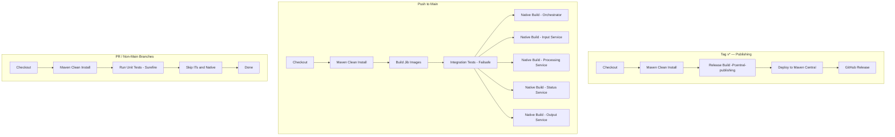

# Builds and Continuous Integration (CI)
The project uses three independent workflows:

1. **build.yml** — PR/non‑main builds
    - Fast build
    - Unit tests only
    - No Jib, no native, no integration tests

2. **full-tests.yml** — push to `main`
    - Full clean build
    - Jib Docker images
    - Integration tests
    - Native builds (matrix)

3. **publish.yml** — `v*` tags
    - Release build
    - Deploys to Maven Central
    - No tests (already validated in main)

## 📛 CI Status

## 🛠️ Build Flags Cheat Sheet

- `-DskipITs` — Skip integration tests
- `-DskipNative=true` — Skip native builds
- `-Dquarkus.container-image.build=false` — Skips building Jib image
- `-Pcoverage` — Enable coverage for unit tests only
- `-Pcentral-publishing` — Release mode for Maven Central deploy
- Avoid mixing `skipTests` and `skipITs`
- Quarkus extensions require full reactor builds (`clean install`)

## CI Architecture Diagram

## 🧩 CLI Flags — TL;DR

| Flag                                    | Meaning                                   | When to Use               |
|-----------------------------------------|-------------------------------------------|---------------------------|
| `-DskipITs`                             | Skips `*IT.java`                          | PRs, fast builds          |
| `-DskipNative=true`                     | Skips native images                       | Everything except main    |
| `-Dquarkus.container-image.build=false` | Skips Jib images (but uses Docker builds) | Full tests on main        |
| `-Pcoverage`                            | Run coverage on unit tests                | PRs, quality gates        |
| `-Pcentral-publishing`                  | Release signing + GPG + deploy            | Only on tags              |
| `-DskipTests`                           | Skips **all** tests                       | ⚠️ Avoid — rarely correct |
| `-Dquarkus.native.enabled=true`         | Enables native build                      | Native matrix stage       |

### Golden Rules
- ❌ **Never** mix `skipTests` + `skipITs`.
- ✔ Always run framework builds with:
  `mvn clean install`
- ✔ Examples (CSV Payments) may be built individually.
- ✔ Native builds must run after integration tests.
