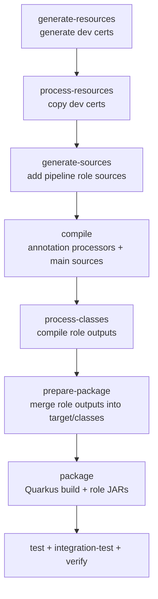

# Pipeline Parent POM Lifecycle (Phase-by-Phase)

This document explains the build lifecycle defined by the generated pipeline
parent POM. It focuses on how pipeline-generated sources are compiled into
role-specific outputs and then merged for runtime packaging.

Reference template: `template-generator-node/templates/parent-pom.hbs`

## Build flow chart

## What the build produces

- pipeline-generated sources under `target/generated-sources/pipeline/*`
- role-specific class outputs under `target/classes-pipeline/*`
- merged runtime classes under `target/classes`
- optional role-specific JARs with classifiers
- dev certificates copied into each module `target/` directory

## Phase-by-phase breakdown

### generate-resources

Plugin: `exec-maven-plugin`

- Runs the dev-certs generator script once in the parent module.
- Output: `<parent>/target/dev-certs/*`

### process-resources

Plugin: `maven-resources-plugin` (copy-dev-certs)

- Copies per-service keystores and truststores into each module `target/`.
- Input: `<parent>/target/dev-certs/${project.artifactId}`
- Output: `${project.build.directory}/server-keystore.jks`,
  `${project.build.directory}/client-truststore.jks`

### generate-sources

Plugin: `build-helper-maven-plugin`

- Adds the pipeline role directories as source roots so they compile later.

### generate-test-sources

Plugin: `build-helper-maven-plugin`

- Adds the same role directories as test sources so tests can compile.

### compile

Plugin: `maven-compiler-plugin` (default-compile)

- Runs annotation processors and generates pipeline code into
  `target/generated-sources/pipeline/*`.

### process-classes

Plugin: `maven-compiler-plugin` (role compiles)

- Compiles each role into separate outputs:
  - `target/classes-pipeline/orchestrator-client`
  - `target/classes-pipeline/pipeline-server`
  - `target/classes-pipeline/plugin-client`
  - `target/classes-pipeline/plugin-server`
  - `target/classes-pipeline/rest-server`

### prepare-package

Plugin: `maven-resources-plugin` (merge-*-classes)

- Merges all role outputs into `target/classes`.
- This is required for Quarkus packaging and Docker images to expose the
  generated gRPC/REST endpoints at runtime.

### package

Plugin: `maven-jar-plugin`

- Builds optional classifier JARs for each role output.

Plugin: `quarkus-maven-plugin`

- Produces the Quarkus application artifacts (`target/quarkus-app`).

### test / integration-test / verify

- Surefire runs unit tests.
- Failsafe runs integration tests.

## Troubleshooting tip

If a gRPC or REST endpoint works in dev mode but 404s in the packaged image,
verify that the role outputs were merged into `target/classes` during
`prepare-package`.
