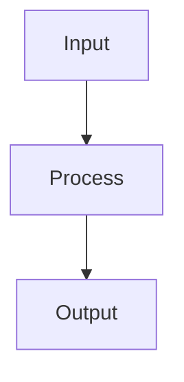

# Creating Pipeline Steps

This guide explains how to create your own pipeline steps using The Pipeline Framework.

<Callout type="tip" title="Rich Step Types">
The Pipeline Framework supports multiple processing patterns including OneToOne, OneToMany, ManyToOne, ManyToMany, SideEffect and blocking variants. Each step type is optimized for specific data transformation scenarios. The Canvas designer at <a href="https://app.pipelineframework.org" target="_blank">https://app.pipelineframework.org</a> allows you to visually configure these step types without writing code.
</Callout>

<Callout type="tip" title="Visual Pipeline Designer">
While you can create pipeline steps programmatically as shown below, you can also design your entire pipeline visually using the Canvas designer at <a href="https://app.pipelineframework.org" target="_blank">https://app.pipelineframework.org</a>. The Canvas allows you to define steps, their types, and connections without writing code, then generates the appropriate configuration files.
</Callout>

## Step 1: Create Your Service Class

Create a class that implements one of the step interfaces and annotate it with `@PipelineStep`:

```java
@PipelineStep(
   inputType = PaymentRecord.class,
   outputType = PaymentStatus.class,
   stepType = StepOneToOne.class,
   inboundMapper = PaymentRecordMapper.class,
   outboundMapper = PaymentStatusMapper.class
)
public class ProcessPaymentService implements StepOneToOne<PaymentRecord, PaymentStatus> {
    @Override
    public Uni<PaymentStatus> apply(Uni<PaymentRecord> request) {
        // Your implementation here
        return request.map(req -> {
            // Transform the request
            return new PaymentStatus();
        });
    }
}
```

## Step 2: Create Your Mapper Classes

Create mapper classes for converting between gRPC, DTO, and domain types using MapStruct. Mappers implement the `Mapper` interface with three generic types (gRPC, DTO, Domain):

```java
@Mapper(
    componentModel = "jakarta",
    uses = {CommonConverters.class},
    unmappedTargetPolicy = ReportingPolicy.WARN
)
public interface MyMapper extends Mapper<MyGrpcType, MyDtoType, MyDomainType> {

    MyMapper INSTANCE = Mappers.getMapper(MyMapper.class);

    // Domain ↔ DTO
    @Override
    MyDtoType toDto(MyDomainType domain);

    @Override
    MyDomainType fromDto(MyDtoType dto);

    // DTO ↔ gRPC
    @Override
    MyGrpcType toGrpc(MyDtoType dto);

    @Override
    MyDtoType fromGrpc(MyGrpcType grpc);
}
```

The MapStruct annotation processor automatically generates the implementation classes. You only need to define the interface methods with appropriate `@Mapping` annotations for complex transformations.

## Step 3: Build Your Project

When you build your project, the framework will automatically generate the necessary adapters and register your step in the pipeline.

## Best Practices

1. Keep your step implementations focused on a single responsibility
2. Use the configuration options in `@PipelineStep` to control behavior
3. Implement proper error handling in your mappers
4. Test your steps in isolation before integrating them into the pipeline

## Diagrams

If you need to include diagrams in your documentation, you can use Mermaid syntax which is supported by the documentation system. For example:


