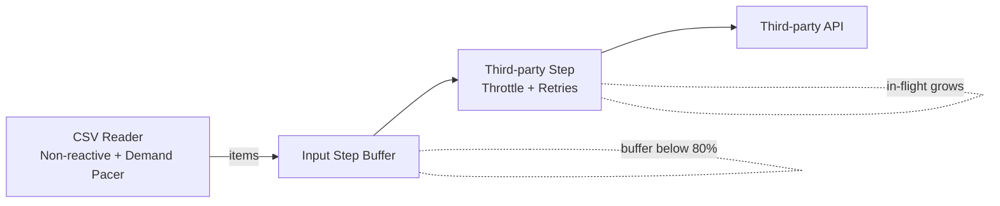
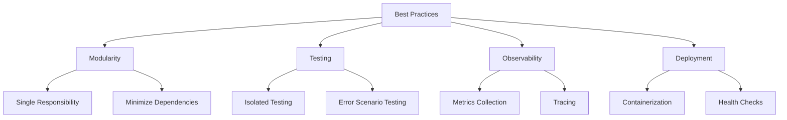

# Best Practices

Follow these best practices when designing and implementing pipeline applications.

## Modularity

- Keep services focused on a single responsibility
- Share only what's necessary through the common module
- Minimize circular dependencies

## Testing

- Test steps in isolation
- Use the framework's testing utilities
- Validate mapper correctness
- Test error scenarios
- Implement integration tests with Testcontainers
- Use Quarkus Dev Mode in your IDE for development

## Observability

- Enable framework's built-in metrics and tracing
- Add meaningful log statements
- Monitor pipeline performance

## Concurrency and Backpressure Sizing

Concurrency and backpressure settings are the two levers that determine how well the pipeline can keep doing useful
work while waiting for I/O.

### How to size `pipeline.max-concurrency`

1. **Start from CPU cores and I/O profile**:
   - CPU-bound steps: set concurrency near the number of vCPUs (for example 4 cores → 4–8).
   - I/O-bound steps: you can go higher (for example 4 cores → 32–128), but validate with metrics.
2. **Watch `tpf.step.inflight`**:
   - If it stays far below the limit, the step cannot use the concurrency (increase only if you see queueing).
   - If it is pinned at the limit and `tpf.step.buffer.queued` is growing, you need more concurrency or a faster downstream.

### How to size `pipeline.defaults.backpressure-buffer-capacity`

1. **Size for burst absorption**:
   - Buffer capacity should cover a burst window you are willing to absorb, not the entire dataset.
2. **Estimate memory impact**:
   - `buffer capacity × average item size = memory footprint per step`.
   - Example: 4-core pod, 1 KB average item size, buffer 4,000 → ~4 MB per step (plus overhead).
3. **Use the buffer metrics**:
   - `tpf.step.buffer.queued` should spike and drain.
   - Flat, high values indicate backpressure is not propagating or downstream is too slow.

### Practical starting point (example)

For a 4-core Graviton pod running I/O-heavy steps:
- `pipeline.max-concurrency`: start at 32–64 for I/O-heavy steps, 4–8 for CPU-heavy steps.
- `pipeline.defaults.backpressure-buffer-capacity`: start at 2,048–8,192 for bursty streams and tune downward.

Always validate in your environment using the in-flight and buffer metrics and adjust per step when needed.

### Quick rule-of-thumb table

| Workload profile | `pipeline.max-concurrency` (per step) | Buffer capacity guidance |
|------------------|---------------------------------------|--------------------------|
| CPU-bound        | 1–2 × vCPU cores                       | Small (128–1,024)        |
| Mixed            | 4–16 × vCPU cores                      | Medium (1,024–4,096)     |
| I/O-bound        | 8–32 × vCPU cores                      | Larger (2,048–8,192)     |

Tune downward if the buffer stays high or GC increases, and upward only when `tpf.step.inflight` is consistently
below the limit while `tpf.step.buffer.queued` spikes.

### Retry amplification example (real-world)

When an upstream step relies on a demand pacer (for example a non-reactive CSV reader) and a downstream step calls a
slow third-party (avg 250 ms per item), it is easy to misconfigure pacing and trigger retry amplification.

Observed pattern:
- Retries climb while `tpf.step.inflight` on the third-party step grows steadily (for example +1,000 every 5 minutes).
- The input step buffer utilization stays below 80%.
- Success rate oscillates around 50% as retries saturate the step.

Mitigations:
- Lower per-step concurrency on the third-party step.
- Increase retry wait/backoff to reduce retry pressure.
- Align the demand pacer with the downstream throughput.

## Deployment

- Package services as independent deployable units
- Use containerization for consistent deployment
- Configure health checks and readiness probes

## Design Best Practices

