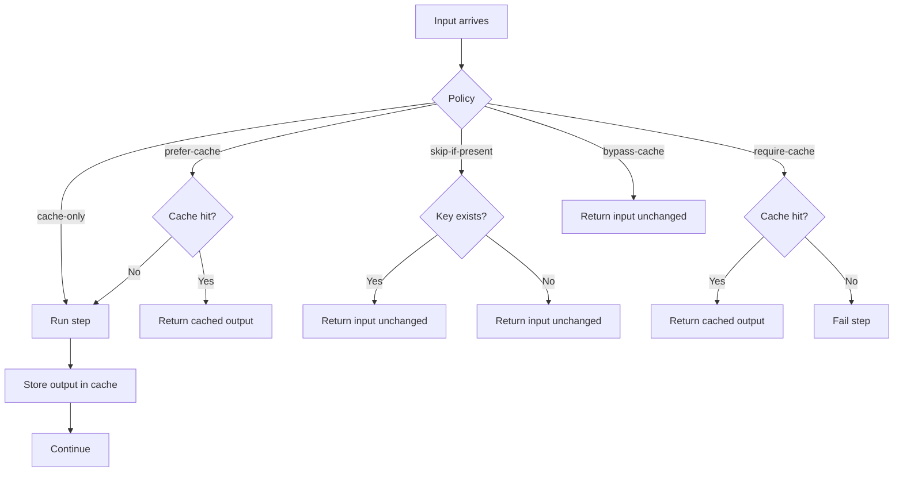

# Cache Policies

Caching policies control how the orchestrator treats cache hits and writes.
The cache plugin reports `x-pipeline-cache-status`, and the runner enforces the policy based on that signal.

## Policies

Set `pipeline.cache.policy`:

- `cache-only`: always cache the item and continue
- `prefer-cache` (aka `return-cached`): use cached value if present, otherwise compute and cache
- `skip-if-present`: if the key exists, skip caching and return the original item
- `require-cache`: return cached value if present, otherwise fail the step
- `bypass-cache`: ignore cache entirely (no read, no write)

`require-cache` fails the step when the runner receives a cache `MISS` status from the cache plugin.

## Policy matrix

| Policy          | Read | Write | Fail on miss |
| --------------- | ---- | ----- | ------------ |
| PREFER_CACHE    | ✅    | ✅     | ❌         |
| SKIP_IF_PRESENT | ❌    | ❌*    | ❌         |
| REQUIRE_CACHE   | ✅    | ❌     | ✅         |
| CACHE_ONLY      | ❌    | ✅     | ❌         |
| BYPASS_CACHE    | ❌    | ❌     | ❌         |

* SKIP_IF_PRESENT only checks existence, it doesn’t read or overwrite.

Execution intents:

1. Normal production run → PREFER_CACHE
2. Deterministic replay → REQUIRE_CACHE
3. Forced rebuild → CACHE_ONLY
4. Debug / verification → BYPASS_CACHE

## Policy decision flow



## Per-request overrides

You can override policy using headers:

```
x-pipeline-cache-policy: prefer-cache
```

Headers are propagated by the orchestrator to downstream steps.

## Version tags

Use `x-pipeline-version` to segregate cache keys during replay:

```
x-pipeline-version: v2
```

This provides logical invalidation without purging old entries.
