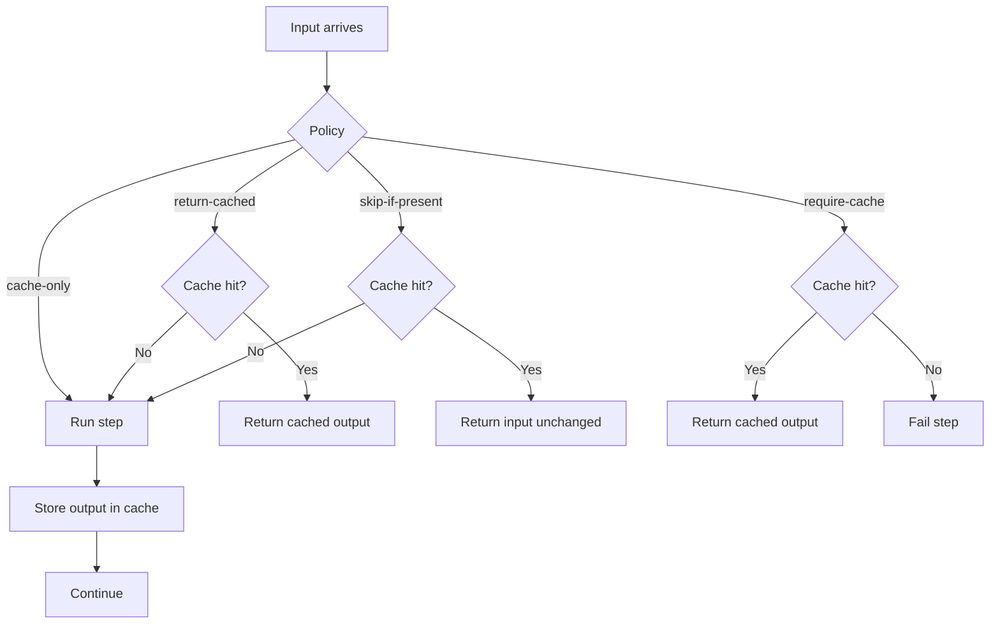

# Cache Policies

Caching policies control how the orchestrator treats cache hits and writes.

## Policies

Set `pipeline.cache.policy`:

- `cache-only`: always cache the item and continue
- `return-cached`: use latest cached if present, otherwise compute and cache
- `skip-if-present`: if the key exists, skip caching and return the original item
- `require-cache`: return cached value if present, otherwise fail the step

`require-cache` raises `CacheMissException`, which the runner treats as non-retryable.

## Policy decision flow



## Per-request overrides

You can override policy using headers:

```
x-pipeline-cache-policy: return-cached
```

Headers are propagated by the orchestrator to downstream steps.

## Version tags

Use `x-pipeline-version` to segregate cache keys during replay:

```
x-pipeline-version: v2
```

This provides logical invalidation without purging old entries.
