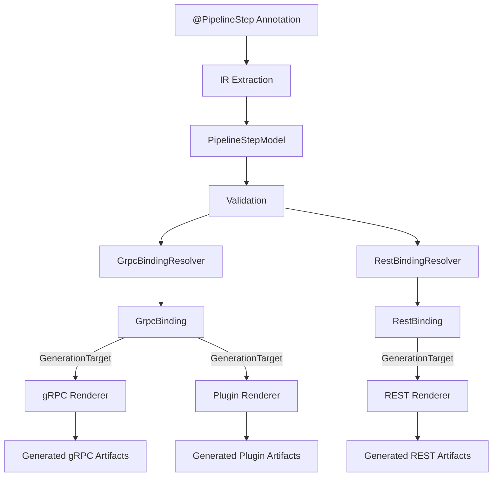
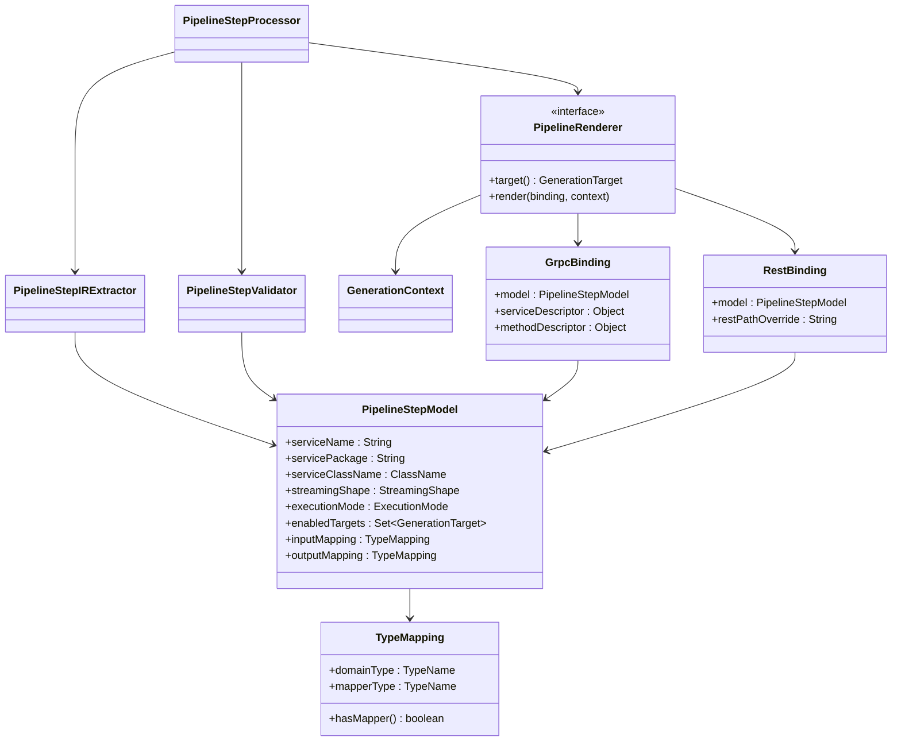

**Pipeline Framework Annotation Processor – Architectural Overview**  
  
**Purpose**  
  
This document describes the architectural refactoring of the **Pipeline Framework (TPF) annotation processor**. The refactoring was undertaken to improve maintainability, extensibility, and conceptual correctness as the framework evolved to support multiple transports (gRPC, REST, plugins) and code‑generation targets.  
  
The result is a **clean, compiler‑style architecture** that separates *semantic intent* from *transport‑specific realization*.  
  
⸻  
  
**Core Design Goals**  
  
The refactoring was guided by the following goals:  
	1.	**Strict separation of concerns** between semantics and code generation  
	2.	**Transport‑agnostic core model**  
	3.	**Small, composable, testable components**  
	4.	**Elimination of procedural, monolithic processors**  
	5.	**Future‑proofing for new transports and targets**  
  
⸻  
  
**High‑Level Architecture**  
  
The annotation processor is structured as a classic multi‑phase compiler pipeline:  
  
Annotations → IR Extraction → Validation → Binding → Rendering  
  
Each phase has a clearly defined responsibility and does not leak concerns into adjacent layers.  
  
⸻  
  
**1. Semantic Model (Intermediate Representation)**  
  
**PipelineStepModel**  
  
The **Intermediate Representation (IR)** is the semantic heart of the processor. It contains *only* information that describes **what a pipeline step is**, not **how it is exposed or transported**.  
  
The IR is:  
	•	Immutable after creation  
	•	Transport‑agnostic  
	•	Derived exclusively from user‑facing annotations  
  
**What the IR contains**  
	•	Service identity (name, package, type)  
	•	Streaming semantics (StreamingShape)  
	•	Directional type mappings (TypeMapping)  
	•	Execution semantics (ExecutionMode)  
	•	Enabled generation targets (GenerationTarget)  
  
**What the IR explicitly does not contain**  
	•	Transport implementation types  
	•	gRPC stubs or service classes  
	•	REST paths  
	•	Client names  
	•	Plugin wiring or side‑effect details  
  
**Design rule:** If a field only exists to support a specific transport, it does not belong in the IR.  
  
⸻  
  
**2. Supporting Semantic Enums**  
  
The IR is supported by small, closed enums that model *conceptual intent*:  
	•	StreamingShape – reactive interaction pattern  
	•	GenerationTarget – which artifacts should be generated  
	•	ExecutionMode – runtime execution semantics  
  
These enums are:  
	•	Transport‑independent  
	•	Stable across backend changes  
	•	Used for type‑safe dispatch instead of boolean flags or string comparisons  
  
⸻  
  
**3. IR Extraction Layer**  
  
**PipelineStepIRExtractor**  
  
This component is responsible for:  
	•	Reading annotation metadata  
	•	Resolving types via the processing environment  
	•	Constructing a valid PipelineStepModel  
  
Extraction is:  
	•	Deterministic  
	•	Side‑effect free  
	•	Free of JavaPoet or generation logic  
  
⸻  
  
**4. Validation Layer**  
  
**PipelineStepValidator**  
  
Validation runs **after IR construction** and enforces semantic correctness:  
	•	Required fields present  
	•	Directional type mappings are consistent  
	•	Invalid annotation combinations rejected early  
  
Validation errors are reported via the annotation processing Messager, before any code generation occurs.  
  
⸻  
  
**5. Binding Layer**  
  
As the framework grew, it became necessary to distinguish between:  
	•	**Semantic intent** (IR)  
	•	**Transport‑specific realization**  
  
This resulted in the introduction of **binding objects**.  
  
Bindings:  
	•	Are derived from the IR  
	•	Are transport‑specific  
	•	Contain implementation‑level details (gRPC descriptors or REST path overrides)  
  
⸻  
  
**6. Renderer Architecture**  
  
**PipelineRenderer Interface**  
  
Each artifact generator implements a common interface:  
	•	GenerationTarget target()  
	•	void render(GrpcBinding or RestBinding, GenerationContext ctx)  
  
This enables:  
	•	Simple dispatcher logic  
	•	Renderer isolation  
	•	Independent evolution of generation strategies  
  
**Renderer Responsibilities**  
  
Renderers own:  
	•	JavaPoet usage  
	•	Naming conventions  
	•	Transport wiring  
	•	Adapter logic  
	•	Backend‑specific invariants  
  
Renderers **interpret** the IR (via the binding); they do not mutate it.  
  
⸻  
  
**7. Processor as Coordinator**  
  
**PipelineStepProcessor**  
  
The main annotation processor is intentionally thin:  
	•	Discovers annotated elements  
	•	Extracts IR  
	•	Validates IR  
	•	Dispatches to renderers  
  
It contains no generation logic and no transport knowledge.  
  
⸻  
  
**Key Architectural Decisions**  
  
**Removal of Transport‑Specific Annotation Parameters**  
  
Transport-specific annotation parameters were intentionally removed from the semantic model.

**Rationale:**  
  
These parameters:  
	•	Do not describe pipeline semantics  
	•	Are meaningful only for specific backends  
	•	Would force the IR to grow with every new transport  
  
They are now handled exclusively by renderer‑specific configuration and bindings.  
  
⸻  
  
**Design Principles Summary**  
	1.	**Semantic purity** – The IR models intent, not implementation  
	2.	**Transport isolation** – Each backend owns its own complexity  
	3.	**Immutability** – IR cannot be modified after validation  
	4.	**Enum‑based dispatch** – No string or boolean‑driven logic  
	5.	**Compiler‑style phases** – Extraction, validation, binding, rendering  
	6.	**Open for extension** – New transports require new renderers, not IR changes  
  
⸻  
  
**Outcome**  
  
This refactoring transforms the TPF annotation processor from a procedural code generator into a **modular, compiler‑inspired architecture**.  
  
The result is:  
	•	Cleaner code  
	•	Easier reasoning  
	•	Safer evolution  
	•	Long‑term maintainability  
  
This architecture is now the foundation for all future Pipeline Framework extensions.  
  
⸻  
  
**Architectural Diagram (Mermaid)**  

**Legend**:  
	•	The IR is the single source of truth  
	•	Bindings are transport-specific  
	•	No renderer mutates the IR  
  
⸻  
  
**Class Diagram (Mermaid)**  
  

  
**Notes**:  
	•	PipelineStepModel is immutable and transport-agnostic  
	•	Bindings are transport-specific and contain transport binding data  
	•	Renderers depend on the binding (and model), never the other way around  
  
⸻  
  
**HOWTO: Add a New Transport**  
  
This section describes how to add a new transport or backend (e.g. Kafka, HTTP/2, WebSockets) without modifying the semantic model.  
  
**Step 1: Define the Generation Target**  
  
Add a new value to GenerationTarget:  
	•	This represents *what* artifact will be generated  
	•	It must not encode *how* the transport works  
  
Example:  
	•	KAFKA_CONSUMER  
  
⸻  
  
**Step 2: Implement a Renderer**  
  
Create a new renderer implementing PipelineRenderer:  
  
Responsibilities:  
	•	Interpret the IR  
	•	Apply transport-specific conventions  
	•	Generate code using JavaPoet  
  
Rules:  
	•	Do not modify the IR  
	•	Do not add transport fields to the IR  
  
⸻  
  
**Step 3: Create Renderer-Specific Bindings**  
  
If the transport requires implementation details:  
	•	Create a binding object local to the renderer  
	•	Derive it from the IR and processing context  
  
Bindings may contain:  
	•	Class names  
	•	Adapter wiring  
	•	Transport-specific configuration  
  
Bindings must never escape the renderer boundary.  
  
⸻  
  
**Step 4: Register the Renderer**  
  
Ensure the renderer is discoverable by the dispatcher:  
	•	Via service loading, DI, or explicit registration  
	•	Based on GenerationTarget  
  
No changes to IR or validation are required.  
  
⸻  
  
**Step 5: (Optional) Add Transport-Specific Annotations**  
  
If user configuration is needed:  
	•	Create a transport-scoped annotation  
	•	Read it *only* in the renderer or binding layer  
  
Never extend @PipelineStep for transport concerns.  
  
⸻  
  
**Anti-Patterns (What Not To Do)**  
  
❌ Do not add transport fields to PipelineStepModel  
❌ Do not introduce boolean flags for backends  
❌ Do not branch on strings or class names  
❌ Do not let renderers depend on each other  
  
⸻  
  
**Final Architectural Guarantee**  
  
Adding a new transport must not require changing the semantic model.  
  
If this rule holds, the architecture remains correct.  
