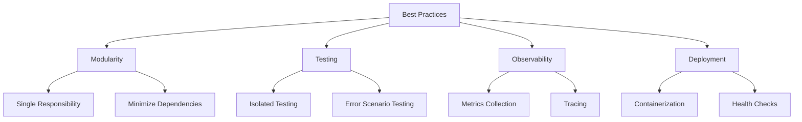

# Best Practices

Follow these best practices when designing and implementing pipeline applications.

## Modularity

- Keep services focused on a single responsibility
- Share only what's necessary through the common module
- Minimize circular dependencies

## Testing

- Test steps in isolation
- Use the framework's testing utilities
- Validate mapper correctness
- Test error scenarios
- Implement integration tests with Testcontainers
- Use Quarkus Dev Mode in your IDE for development

## Observability

- Enable framework's built-in metrics and tracing
- Add meaningful log statements
- Monitor pipeline performance

## Deployment

- Package services as independent deployable units
- Use containerization for consistent deployment
- Configure health checks and readiness probes

## Design Best Practices

