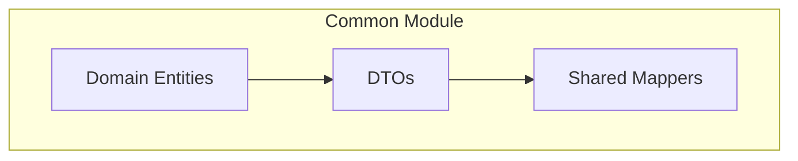

# Common Module Structure

The common module contains shared components used across all services in a pipeline application.

## Domain Entities

Domain entities represent the core business concepts:

```java
// common/src/main/java/com/example/app/common/domain/PaymentRecord.java
public class PaymentRecord {
    private UUID id;
    private String csvId;
    private String recipient;
    private BigDecimal amount;
    private Currency currency;
    // constructors, getters, setters...
}
```

## DTOs

Data Transfer Objects are used for inter-service communication:

```java
// common/src/main/java/com/example/app/common/dto/PaymentRecordDto.java
public class PaymentRecordDto {
    private UUID id;
    private String csvId;
    private String recipient;
    private BigDecimal amount;
    private Currency currency;
    // constructors, getters, setters...
}
```

## Shared Mappers

Mappers that are used across multiple services should be in the common module using MapStruct and implementing the unified Mapper interface:

```java
// common/src/main/java/com/example/app/common/mapper/PaymentRecordMapper.java
@Mapper(
    componentModel = "jakarta",
    uses = {CommonConverters.class},
    unmappedTargetPolicy = ReportingPolicy.WARN
)
public interface PaymentRecordMapper extends Mapper<PaymentRecordGrpc, PaymentRecordDto, PaymentRecord> {

    PaymentRecordMapper INSTANCE = Mappers.getMapper(PaymentRecordMapper.class);

    // Domain ↔ DTO
    @Override
    PaymentRecordDto toDto(PaymentRecord domain);

    @Override
    PaymentRecord fromDto(PaymentRecordDto dto);

    // DTO ↔ gRPC
    @Override
    @Mapping(target = "id", qualifiedByName = "uuidToString")
    @Mapping(target = "amount", qualifiedByName = "bigDecimalToString")
    @Mapping(target = "currency", qualifiedByName = "currencyToString")
    PaymentRecordGrpc toGrpc(PaymentRecordDto dto);

    @Override
    @Mapping(target = "id", qualifiedByName = "stringToUUID")
    @Mapping(target = "amount", qualifiedByName = "stringToBigDecimal")
    @Mapping(target = "currency", qualifiedByName = "stringToCurrency")
    PaymentRecordDto fromGrpc(PaymentRecordGrpc grpc);
}
```

## Module Dependencies Diagram

