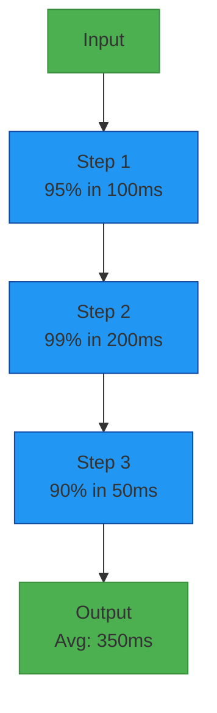

# Observability

This guide explains how to monitor, trace, and observe pipeline applications built with The Pipeline Framework using industry-standard tools and practices.

## Overview

Observability in The Pipeline Framework encompasses:

1. **Metrics**: Collecting quantitative data about pipeline performance
2. **Tracing**: Tracking requests as they flow through the pipeline
3. **Logging**: Structured logging with context for debugging
4. **Health Checks**: Monitoring service availability and readiness

The framework provides built-in support for metrics and health checks through Quarkus and Micrometer.

## Metrics Collection

### Built-in Metrics

The Pipeline Framework automatically collects various metrics:

```java
// Automatic metrics collected:
// - Pipeline execution duration
// - Step execution time
// - Success/failure rates
// - Throughput counters
// - Error counts by type
// - Resource utilization
```

### Custom Metrics

Add custom metrics to your services:

```java
@PipelineStep(
    // ... configuration
)
@ApplicationScoped
public class ProcessPaymentService implements StepOneToOne<PaymentRecord, PaymentStatus> {
    
    @Inject
    MetricRegistry metricRegistry;
    
    private Timer processingTimer;
    private Counter successCounter;
    private Counter failureCounter;
    private Histogram paymentAmountHistogram;
    
    @PostConstruct
    void initializeMetrics() {
        processingTimer = metricRegistry.timer("payment.processing.duration");
        successCounter = metricRegistry.counter("payment.processing.success");
        failureCounter = metricRegistry.counter("payment.processing.failure");
        paymentAmountHistogram = metricRegistry.histogram("payment.amount.distribution");
    }
    
    @Override
    public Uni<PaymentStatus> applyOneToOne(PaymentRecord paymentRecord) {
        Timer.Context timerContext = processingTimer.time();
        paymentAmountHistogram.update(paymentRecord.getAmount().doubleValue());
        
        return processPayment(paymentRecord)
            .onItem().invoke(result -> {
                timerContext.stop();
                successCounter.inc();
                LOG.info("Payment processed successfully: amount={}", paymentRecord.getAmount());
            })
            .onFailure().invoke(error -> {
                timerContext.stop();
                failureCounter.inc();
                LOG.error("Payment processing failed: amount={}", paymentRecord.getAmount(), error);
            });
    }
    
    private Uni<PaymentStatus> processPayment(PaymentRecord record) {
        // Implementation
        return Uni.createFrom().item(/* ... */);
    }
}
```

### Micrometer Integration

The framework integrates with Micrometer for metrics collection:

```properties
# application.properties
# Enable Micrometer
quarkus.micrometer.enabled=true
quarkus.micrometer.export.prometheus.enabled=true
quarkus.micrometer.export.prometheus.path=/q/metrics
quarkus.micrometer.binder.http-server.enabled=true
quarkus.micrometer.binder.http-client.enabled=true

# Configure histogram buckets
quarkus.micrometer.distribution.percentiles-histogram.http.server.requests=true
quarkus.micrometer.distribution.percentiles-histogram.http.client.requests=true
```

## Distributed Tracing

### OpenTelemetry Integration

The framework supports OpenTelemetry for distributed tracing:

```properties
# application.properties
# Enable OpenTelemetry
quarkus.otel.enabled=true
quarkus.otel.traces.enabled=true
quarkus.otel.exporter.otlp.endpoint=http://localhost:4317
quarkus.otel.exporter.otlp.protocol=grpc

# Configure tracing sampler
quarkus.otel.traces.sampler=always_on
```

### Custom Spans

Add custom spans to your services:

```java
@PipelineStep(
    // ... configuration
)
@ApplicationScoped
public class ProcessPaymentService implements StepOneToOne<PaymentRecord, PaymentStatus> {
    
    @Inject
    Tracer tracer;
    
    @Override
    public Uni<PaymentStatus> applyOneToOne(PaymentRecord paymentRecord) {
        Span span = tracer.spanBuilder("process-payment")
            .setAttribute("payment.id", paymentRecord.getId().toString())
            .setAttribute("payment.amount", paymentRecord.getAmount().doubleValue())
            .setAttribute("payment.currency", paymentRecord.getCurrency().getCurrencyCode())
            .setAttribute("payment.recipient", paymentRecord.getRecipient())
            .startSpan();
            
        try (Scope scope = span.makeCurrent()) {
            return processPayment(paymentRecord)
                .onItem().invoke(result -> {
                    span.setStatus(StatusCode.OK);
                    LOG.info("Payment processed successfully");
                })
                .onFailure().invoke(error -> {
                    span.recordException(error);
                    span.setStatus(StatusCode.ERROR, error.getMessage());
                    LOG.error("Payment processing failed", error);
                });
        } finally {
            span.end();
        }
    }
    
    private Uni<PaymentStatus> processPayment(PaymentRecord record) {
        // Add sub-spans for individual operations
        Span validationSpan = tracer.spanBuilder("validate-payment")
            .setAttribute("validation.type", "business-rules")
            .startSpan();
            
        try (Scope scope = validationSpan.makeCurrent()) {
            validatePayment(record);
            validationSpan.setStatus(StatusCode.OK);
        } catch (Exception e) {
            validationSpan.recordException(e);
            validationSpan.setStatus(StatusCode.ERROR, e.getMessage());
            throw e;
        } finally {
            validationSpan.end();
        }
        
        // Continue with processing...
        return Uni.createFrom().item(/* ... */);
    }
    
    private void validatePayment(PaymentRecord record) {
        // Validation logic
    }
}
```

### Context Propagation

Ensure trace context propagation across services:

```java
@Override
public Uni<PaymentStatus> applyOneToOne(PaymentRecord paymentRecord) {
    // Trace context is automatically propagated through gRPC calls
    return grpcClient.remoteProcess(convertToGrpc(paymentRecord))
        .onItem().transform(this::convertFromGrpc)
        .onFailure().recoverWithUni(error -> {
            // Handle errors while preserving trace context
            LOG.error("gRPC call failed", error);
            return Uni.createFrom().failure(error);
        });
}
```

## Structured Logging

### MDC Integration

Use MDC (Mapped Diagnostic Context) for structured logging:

```java
@PipelineStep(
    // ... configuration
)
@ApplicationScoped
public class ProcessPaymentService implements StepOneToOne<PaymentRecord, PaymentStatus> {
    
    private static final Logger LOG = LoggerFactory.getLogger(ProcessPaymentService.class);
    
    @Override
    public Uni<PaymentStatus> applyOneToOne(PaymentRecord paymentRecord) {
        // Add context to MDC
        MDC.put("paymentId", paymentRecord.getId().toString());
        MDC.put("customerId", paymentRecord.getCustomerId());
        MDC.put("amount", paymentRecord.getAmount().toString());
        MDC.put("currency", paymentRecord.getCurrency().getCurrencyCode());
        
        try {
            LOG.info("Starting payment processing");
            
            return processPayment(paymentRecord)
                .onItem().invoke(result -> {
                    LOG.info("Payment processed successfully: status={}", result.getStatus());
                })
                .onFailure().invoke(error -> {
                    LOG.error("Payment processing failed", error);
                });
        } finally {
            // Clean up MDC
            MDC.clear();
        }
    }
}
```

### JSON Logging

Configure JSON logging for better log analysis:

```properties
# application.properties
# Enable JSON logging
quarkus.log.handler.console.json.enabled=true
quarkus.log.handler.console.json.pretty-print=false
quarkus.log.handler.console.json.fields.timestamp.field-name=@timestamp
quarkus.log.handler.console.json.fields.logger.field-name=loggerName
quarkus.log.handler.console.json.fields.level.field-name=logLevel
```

### Log Levels

Configure appropriate log levels for different environments:

```properties
# application-dev.properties
quarkus.log.category."org.pipelineframework".level=DEBUG
quarkus.log.category."com.example.app".level=DEBUG

# application-prod.properties
quarkus.log.category."org.pipelineframework".level=INFO
quarkus.log.category."com.example.app".level=WARN
```

## Health Checks

### Built-in Health Checks

The framework provides built-in health checks:

```java
// Health check endpoints automatically available at:
// GET /q/health
// GET /q/health/live
// GET /q/health/ready
```

### Custom Health Checks

Add custom health checks to your services:

```java
@ApplicationScoped
public class PaymentProcessingHealthCheck implements HealthCheck {
    
    @Inject
    PaymentServiceClient paymentServiceClient;
    
    @Override
    public HealthCheckResponse call() {
        try {
            // Check if external payment service is reachable
            boolean isHealthy = paymentServiceClient.ping()
                .await().atMost(Duration.ofSeconds(5));
                
            return HealthCheckResponse.named("payment-service")
                .withData("endpoint", paymentServiceClient.getEndpoint())
                .status(isHealthy)
                .build();
        } catch (Exception e) {
            return HealthCheckResponse.named("payment-service")
                .withData("error", e.getMessage())
                .down()
                .build();
        }
    }
}
```

Register health checks:

```properties
# application.properties
# Register custom health check
quarkus.health.exclude=false
```

## Alerting and Monitoring

### Prometheus Alerts

Define alerts in Prometheus:

```yaml
# prometheus-alerts.yml
groups:
- name: pipeline-alerts
  rules:
  - alert: HighErrorRate
    expr: rate(payment_processing_failure[5m]) > 0.05
    for: 2m
    labels:
      severity: warning
    annotations:
      summary: "High error rate in payment processing"
      description: "Payment processing error rate is above 5% for the last 5 minutes"

  - alert: HighLatency
    expr: histogram_quantile(0.95, rate(payment_processing_duration_seconds_bucket[5m])) > 30
    for: 2m
    labels:
      severity: critical
    annotations:
      summary: "High latency in payment processing"
      description: "95th percentile payment processing latency exceeds 30 seconds"
```

### Grafana Dashboards

Create comprehensive dashboards in Grafana:

```json
{
  "dashboard": {
    "title": "Pipeline Application Metrics",
    "panels": [
      {
        "title": "Pipeline Execution Rate",
        "type": "graph",
        "targets": [
          {
            "expr": "rate(pipeline_execution_total[5m])",
            "legendFormat": "{{status}}"
          }
        ]
      },
      {
        "title": "Average Processing Time",
        "type": "graph",
        "targets": [
          {
            "expr": "rate(pipeline_processing_duration_seconds_sum[5m]) / rate(pipeline_processing_duration_seconds_count[5m])",
            "legendFormat": "avg_processing_time"
          }
        ]
      },
      {
        "title": "Error Distribution",
        "type": "piechart",
        "targets": [
          {
            "expr": "pipeline_error_total",
            "legendFormat": "{{error_type}}"
          }
        ]
      }
    ]
  }
}
```

## Monitoring Pipeline Steps

### Step-Level Metrics

Monitor individual pipeline steps:

```java
@PipelineStep(
    // ... configuration
)
@ApplicationScoped
public class ProcessPaymentService implements StepOneToOne<PaymentRecord, PaymentStatus> {
    
    private Timer stepTimer;
    private Counter stepSuccess;
    private Counter stepFailure;
    private Gauge queueSize;
    
    @PostConstruct
    void initializeStepMetrics() {
        String stepName = this.getClass().getSimpleName();
        
        stepTimer = metricRegistry.timer(
            MetricRegistry.name("pipeline", "step", stepName, "duration")
        );
        
        stepSuccess = metricRegistry.counter(
            MetricRegistry.name("pipeline", "step", stepName, "success")
        );
        
        stepFailure = metricRegistry.counter(
            MetricRegistry.name("pipeline", "step", stepName, "failure")
        );
        
        queueSize = metricRegistry.gauge(
            MetricRegistry.name("pipeline", "step", stepName, "queue-size"),
            new AtomicLong(0)
        );
    }
    
    @Override
    public Uni<PaymentStatus> applyOneToOne(PaymentRecord paymentRecord) {
        Timer.Context timerContext = stepTimer.time();
        
        return processPayment(paymentRecord)
            .onItem().invoke(result -> {
                timerContext.stop();
                stepSuccess.inc();
                LOG.info("Step {} completed successfully", this.getClass().getSimpleName());
            })
            .onFailure().invoke(error -> {
                timerContext.stop();
                stepFailure.inc();
                LOG.error("Step {} failed", this.getClass().getSimpleName(), error);
            });
    }
}
```

### Pipeline Flow Visualization

Create visualizations to monitor pipeline flow:



## Best Practices

### Metrics Design

1. **Use Meaningful Names**: Follow naming conventions (e.g., `pipeline.step.duration`)
2. **Include Dimensions**: Add labels for filtering and grouping
3. **Avoid High Cardinality**: Don't use unique identifiers as label values
4. **Measure What Matters**: Focus on business-relevant metrics

### Tracing Strategy

1. **Span Coverage**: Instrument all major operations
2. **Attribute Selection**: Include relevant context as span attributes
3. **Error Recording**: Record exceptions with full stack traces
4. **Context Propagation**: Ensure trace context flows through all services

### Logging Standards

1. **Structured Format**: Use JSON logging in production
2. **Contextual Information**: Include MDC with request context
3. **Appropriate Levels**: Use DEBUG, INFO, WARN, ERROR appropriately
4. **Sensitive Data**: Never log sensitive information

### Health Check Design

1. **Fast Responses**: Health checks should respond quickly
2. **Meaningful Status**: Reflect actual service health
3. **Graceful Degradation**: Indicate partial availability when appropriate
4. **External Dependencies**: Consider dependency health in readiness checks

### Alerting Principles

1. **Actionable Alerts**: Only alert on issues requiring human intervention
2. **Clear Descriptions**: Include enough context to understand the issue
3. **Appropriate Severity**: Use warning vs critical levels appropriately
4. **Noise Reduction**: Tune thresholds to minimize false positives

The Pipeline Framework's observability features provide comprehensive monitoring capabilities to ensure your pipeline applications are reliable, performant, and maintainable in production environments.