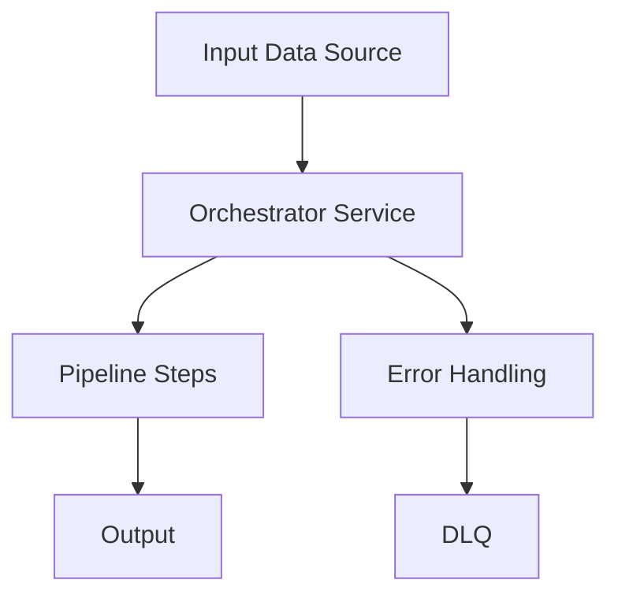

# Orchestrator Service Structure

The orchestrator service coordinates the pipeline execution and manages the overall flow of data through the pipeline.

## Orchestrator Application

The orchestrator implements the framework's `QuarkusApplication` interface and `Callable<Integer>` for command-line interface:

```java
// orchestrator-svc/src/main/java/com/example/app/orchestrator/OrchestratorApplication.java
@CommandLine.Command(
    name = "orchestrator",
    mixinStandardHelpOptions = true,
    version = "1.0.0",
    description = "{{appName}} Orchestrator Service")
public class OrchestratorApplication implements QuarkusApplication, Callable<Integer> {

    @Option(
        names = {"-i", "--input"}, 
        description = "Input value for the pipeline",
        defaultValue = "${sys:quarkus.pipeline.input:-${env:PIPELINE_INPUT}}"
    )
    String input;

    @Inject
    PipelineExecutionService pipelineExecutionService;

    @Override
    public int run(String... args) {
        return new CommandLine(this).execute(args);
    }

    public Integer call() {
        if (input == null || input.trim().isEmpty()) {
            System.err.println("Input parameter is required");
            return CommandLine.ExitCode.USAGE;
        }
        
        Multi<{{firstInputTypeName}}> inputMulti = getInputMulti(input);

        // Execute the pipeline with the processed input using injected service
        pipelineExecutionService.executePipeline(inputMulti)
            .collect().asList()
            .await().indefinitely();

        System.out.println("Pipeline execution completed");
        return CommandLine.ExitCode.OK;
    }
    
    // This method needs to be implemented by the user after template generation
    // based on their specific input type and requirements
    private Multi<{{firstInputTypeName}}> getInputMulti(String input) {
        // TODO: User needs to implement this method after template generation
        // Create and return appropriate Multi based on the input and first step requirements
        // For example:
        // {{firstInputTypeName}} inputItem = new {{firstInputTypeName}}();
        // inputItem.setField(input);
        // return Multi.createFrom().item(inputItem);
        
        throw new UnsupportedOperationException("Method getInputMulti needs to be implemented by user after template generation");
    }
}
```

## Pipeline Execution Service

Handles the orchestration logic:

```java
// orchestrator-svc/src/main/java/com/example/app/orchestrator/service/ProcessFolderService.java
@ApplicationScoped
public class ProcessFolderService {
    
    public Stream<CsvPaymentsInputFile> process(String csvFolderPath) {
        // Logic to read CSV files and convert to domain objects
        return Stream.of(/* ... */);
    }
}
```

## Orchestrator Architecture

