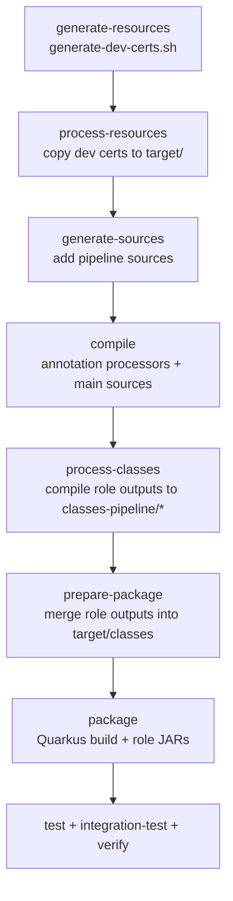

# CSV Payments POM Lifecycle (Phase-by-Phase)

This document explains what the `examples/csv-payments/pom.xml` build does at each Maven
phase. It is intentionally phase-ordered so you can trace where generated sources
appear and when they are packaged into the runnable artifacts.

Reference POM: `examples/csv-payments/pom.xml`

## Build flow chart

## Overview: What the build is trying to achieve

The build produces five kinds of generated artifacts:

- pipeline-generated sources (client/server steps and adapters)
- role-specific compiled classes under `target/classes-pipeline/*`
- merged runtime classes under `target/classes` (for Quarkus packaging)
- optional role-specific JARs (classifiers)
- dev certificates copied into module targets

The key detail is that the generated role outputs are compiled into separate
directories and then merged back into `target/classes` before packaging. This is
required for Quarkus packaging and the Docker images to expose the generated
gRPC/REST endpoints at runtime.

## Phase-by-phase breakdown

### generate-resources

Plugin: `exec-maven-plugin`

- Executes `generate-dev-certs.sh` once in the parent module only.
- Output: `examples/csv-payments/target/dev-certs/*`
- Note: this execution is marked `<inherited>false</inherited>`, so it only runs on the
  parent module.

### process-resources

Plugin: `maven-resources-plugin` (copy-dev-certs)

- Copies the generated dev certs into each module's `target/` directory.
- Input: `../target/dev-certs/${project.artifactId}`
- Output: `${project.build.directory}/server-keystore.jks` and
  `${project.build.directory}/client-truststore.jks` (if present).

### generate-sources

Plugin: `build-helper-maven-plugin` (add-pipeline-generated-sources)

- Adds pipeline-generated source roots so Maven compiles them later:
  - `target/generated-sources/pipeline/orchestrator-client`
  - `target/generated-sources/pipeline/pipeline-server`
  - `target/generated-sources/pipeline/plugin-client`
  - `target/generated-sources/pipeline/plugin-server`
  - `target/generated-sources/pipeline/rest-server`

### generate-test-sources

Plugin: `build-helper-maven-plugin` (add-pipeline-generated-test-sources)

- Adds the same generated source roots to the test compilation classpath.

### compile

Plugin: `maven-compiler-plugin` (default-compile)

- Runs the annotation processors and compiles normal sources.
- Important compiler args:
  - `${pipeline.generatedSourcesArg}` (pipeline generator output)
  - `${protobuf.descriptor.fileArg}` (gRPC descriptor set)
- Generated Java source output for pipeline roles goes to
  `target/generated-sources/pipeline/*`.

### process-classes

Plugin: `maven-compiler-plugin` (role-specific compile executions)

Each execution compiles a single role into its own output directory:

- `compile-orchestrator-client` -> `target/classes-pipeline/orchestrator-client`
- `compile-pipeline-server` -> `target/classes-pipeline/pipeline-server`
- `compile-plugin-client` -> `target/classes-pipeline/plugin-client`
- `compile-plugin-server` -> `target/classes-pipeline/plugin-server`
- `compile-rest-server` -> `target/classes-pipeline/rest-server`

These role outputs are intentionally separate so they can be packaged as
classified JARs and merged selectively.

### prepare-package

Plugin: `maven-resources-plugin` (merge-*-classes)

This is the critical merge step for runtime packaging:

- Copies each `target/classes-pipeline/*` directory into
  `${project.build.outputDirectory}` (i.e., `target/classes`).
- Without this step, Quarkus packaging will not include the generated adapters
  and gRPC/REST endpoints may 404 at runtime in the container.

### package

Plugin: `maven-jar-plugin` (role-specific JARs)

- Builds optional classifier JARs for each role output:
  - `*-orchestrator-client.jar`
  - `*-pipeline-server.jar`
  - `*-plugin-client.jar`
  - `*-plugin-server.jar`
  - `*-rest-server.jar`

Plugin: `quarkus-maven-plugin`

- Produces the Quarkus application artifacts (`target/quarkus-app`).
- Relies on `target/classes` which now includes the merged pipeline role classes.

### test

Plugin: `maven-surefire-plugin`

- Runs unit tests using JUnit 5.

### integration-test / verify

Plugin: `maven-failsafe-plugin`

- Runs integration tests (`*IT`) and fails the build on verification errors.

## Where to look when something is missing at runtime

- `target/classes-pipeline/*` has the compiled role outputs.
- `target/classes` should contain those merged classes after `prepare-package`.
- `target/quarkus-app` and Docker images use `target/classes`.

If a gRPC/REST endpoint 404s in a container but works in dev mode, it typically
means the role classes were compiled but not merged into `target/classes` before
packaging.
