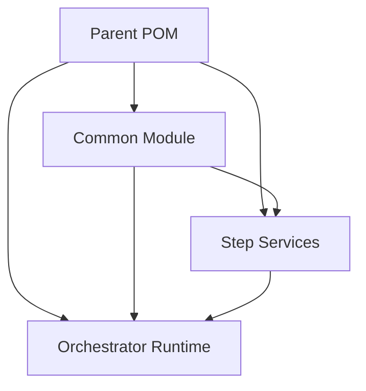

# Dependency Management

Proper dependency management is crucial for maintaining clean, modular pipeline applications.

## Parent POM

The parent POM defines common properties and manages dependencies. The pipeline framework is included as a single dependency that bundles both runtime and build-time components:

```xml
<!-- pom.xml -->
<project>
    <groupId>com.example</groupId>
    <artifactId>my-pipeline-application-parent</artifactId>
    <version>1.0.0</version>
    <packaging>pom</packaging>
    
    <modules>
        <module>common</module>
        <module>step-one-svc</module>
        <module>step-two-svc</module>
        <module>orchestrator-svc</module>
    </modules>
    
    <dependencyManagement>
        <dependencies>
            <dependency>
                <groupId>com.example</groupId>
                <artifactId>common</artifactId>
                <version>${project.version}</version>
            </dependency>
            <dependency>
                <groupId>com.example</groupId>
                <artifactId>pipeline-framework-runtime</artifactId>
                <version>${project.version}</version>
            </dependency>
        </dependencies>
    </dependencyManagement>
</project>
```

## Service POMs

Services declare dependencies on the common module and framework. Both runtime and deployment components are bundled in a single dependency:

```xml
<!-- step-one-svc/pom.xml -->
<project>
    <parent>
        <groupId>com.example</groupId>
        <artifactId>my-pipeline-application-parent</artifactId>
        <version>1.0.0</version>
    </parent>
    
    <artifactId>step-one-svc</artifactId>
    
    <dependencies>
        <dependency>
            <groupId>com.example</groupId>
            <artifactId>common</artifactId>
        </dependency>
        <dependency>
            <groupId>com.example</groupId>
            <artifactId>pipeline-framework</artifactId>
        </dependency>
    </dependencies>
</project>
```

## Build Warning Note

When compiling role-specific outputs in a single module (for example, orchestrator-client and pipeline-server), Maven may emit a warning like "Overwriting artifact's file". This comes from the compiler plugin updating the project's output directory per execution and does not indicate class files are being overwritten.

## Dependency Flow Diagram


