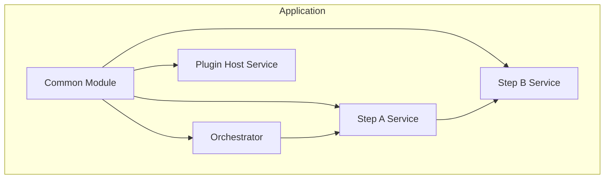

# Application Structure

This guide describes the recommended module layout for a Pipeline Framework application and how generated artifacts fit into it.

<Callout type="tip" title="Visual Design with Canvas">
The Canvas designer at <a href="https://app.pipelineframework.org" target="_blank" rel="noopener noreferrer">https://app.pipelineframework.org</a> generates this structure automatically and keeps it consistent across services.
</Callout>

## Core Modules

A typical pipeline application consists of:

1. **Orchestrator Runtime**: Loads the pipeline order and invokes client steps.
2. **Step Services**: Each service implements a single step.
3. **Common Module**: Shared domain types, DTOs, gRPC messages, and mappers.
4. **Plugin Services (optional)**: Host plugin server and client code (persistence, cache, etc.).
5. **Framework Modules**: Runtime (dependency) and Deployment (build-time).

## Project Layout

```text
my-pipeline-application/
├── pom.xml
├── pipeline.yaml                     # Optional pipeline config (or config/pipeline.yaml)
├── common/
│   └── src/main/java/...            # Domain, DTOs, proto, shared mappers
├── orchestrator-svc/
│   └── src/main/java/...            # Orchestrator runtime + CLI
├── step-a-svc/
│   └── src/main/java/...            # Step implementation + mappers
├── step-b-svc/
│   └── src/main/java/...            # Step implementation + mappers
├── plugins/
│   └── custom-plugin/               # Plugin implementation module(s)
└── persistence-svc/                 # Plugin host service (gRPC)
```

## Generated Artifacts

At build time, the annotation processor generates role-specific sources into:

```text
target/generated-sources/pipeline/<role>
```

These are compiled and packaged into role-based classifier JARs (client steps, gRPC adapters, REST resources). The orchestrator and plugin host modules depend on the classifiers they need.

## Dependency Flow



## Related Guides

- [Common Module Structure](/versions/v26.2/guide/design/common-module-structure)
- [Configuration Reference](/versions/v26.2/guide/build/configuration/)
- [Orchestrator Runtime](/versions/v26.2/guide/development/orchestrator-runtime)
