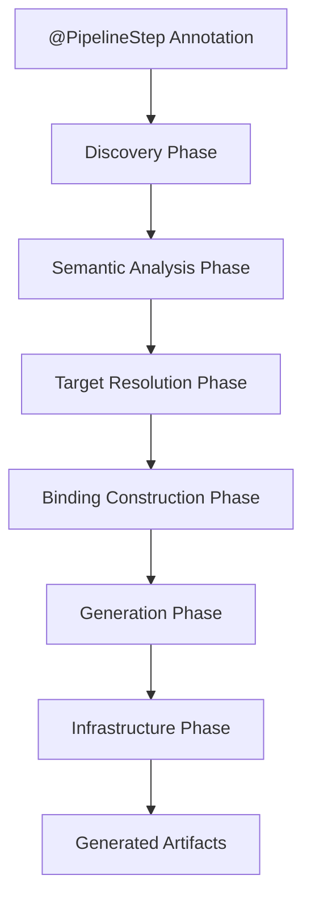
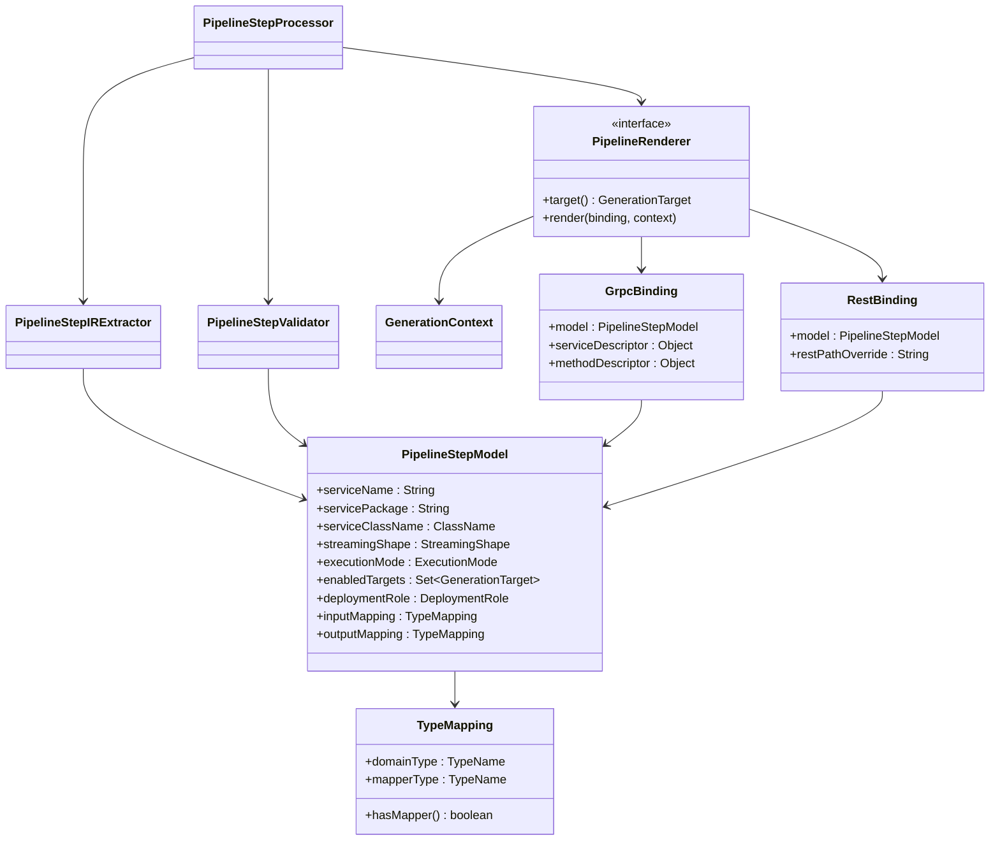

# Pipeline Framework Annotation Processor Architecture

## Purpose

This document describes the annotation processor refactoring in the Pipeline Framework (TPF). The refactor improves maintainability, extensibility, and conceptual correctness as the framework supports multiple transports (gRPC, REST, plugins) and code generation targets.

The result is a compiler-style architecture that separates semantic intent from transport-specific realization.

## Core design goals

- Strict separation of concerns between semantics and code generation.
- Transport-agnostic core model.
- Small, composable, testable components.
- Elimination of procedural, monolithic processors.
- Future-proofing for new transports and targets.

## High-level architecture

The annotation processor follows a multi-phase compiler pipeline:

Annotations -> Discovery -> Semantic Analysis -> Target Resolution -> Binding Construction -> Generation -> Infrastructure

Each phase has a clearly defined responsibility and does not leak concerns into adjacent layers.

This architecture is detailed in the [Compiler Pipeline Architecture](compiler-pipeline-architecture.md) document.

## 1. Semantic model (intermediate representation)

### PipelineStepModel

The Intermediate Representation (IR) is the semantic heart of the processor. It contains only information that describes what a pipeline step is, not how it is exposed or transported.

The IR is:

- Immutable after creation.
- Transport-agnostic.
- Derived exclusively from user-facing annotations.

The IR contains:

- Service identity (name, package, type).
- Streaming semantics (`StreamingShape`).
- Directional type mappings (`TypeMapping`).
- Execution semantics (`ExecutionMode`).
- Enabled generation targets (`GenerationTarget`).
- Deployment role (`DeploymentRole`).

The IR does not contain:

- Transport implementation types.
- gRPC stubs or service classes.
- REST paths.
- Client names.
- Plugin wiring or side-effect details.

Design rule: if a field only exists to support a specific transport, it does not belong in the IR.

## 2. Supporting semantic enums

The IR is supported by small, closed enums that model conceptual intent:

- `StreamingShape`: reactive interaction pattern.
- `GenerationTarget`: which artifacts should be generated.
- `ExecutionMode`: runtime execution semantics.

These enums are:

- Transport-independent.
- Stable across backend changes.
- Used for type-safe dispatch instead of boolean flags or string comparisons.

## 3. IR extraction layer

### PipelineStepIRExtractor

This component is responsible for:

- Reading annotation metadata.
- Resolving types via the processing environment.
- Constructing a valid `PipelineStepModel`.

Extraction is:

- Deterministic.
- Side-effect free.
- Free of JavaPoet or generation logic.

## 4. Validation layer

### PipelineStepValidator

Validation runs after IR construction and enforces semantic correctness:

- Required fields present.
- Directional type mappings are consistent.
- Invalid annotation combinations rejected early.

Validation errors are reported via the annotation processing `Messager`, before any code generation occurs.

## 5. Binding layer

As the framework grew, it became necessary to distinguish between:

- Semantic intent (IR).
- Transport-specific realization.

This resulted in binding objects.

Bindings:

- Are derived from the IR.
- Are transport-specific.
- Contain implementation-level details (gRPC descriptors or REST path overrides).
- May be pre-resolved for synthetic steps (side-effect expansion).

## 6. Renderer architecture

### PipelineRenderer interface

Each artifact generator implements a common interface:

- `GenerationTarget target()`
- `void render(GrpcBinding or RestBinding, GenerationContext ctx)`

This enables:

- Simple dispatcher logic.
- Renderer isolation.
- Independent evolution of generation strategies.

### Renderer responsibilities

Renderers own:

- JavaPoet usage.
- Naming conventions.
- Transport wiring.
- Adapter logic.
- Backend-specific invariants.

Renderers interpret the IR via the binding; they do not mutate it.

### Role-specific output directories

Generated sources are emitted into role-specific directories, not sliced after compilation:

- `target/generated-sources/pipeline/orchestrator-client`
- `target/generated-sources/pipeline/pipeline-server`
- `target/generated-sources/pipeline/plugin-client`
- `target/generated-sources/pipeline/plugin-server`
- `target/generated-sources/pipeline/rest-server`

Each renderer writes to the role directory determined by the model/binding, and Maven packages each directory as a classifier JAR. This removes the need for post-compilation slicing and class-name heuristics.

## 7. Processor as coordinator

### PipelineStepProcessor

The main annotation processor is intentionally thin:

- Discovers annotated elements.
- Extracts IR.
- Validates IR.
- Dispatches to renderers.

It contains no generation logic and no transport knowledge.

## Plugin host modules

Plugin-generated gRPC adapters and client steps are emitted in a dedicated host module identified by a marker annotation:

- `@PipelinePlugin("name")` marks the module that hosts plugin-server and plugin-client artifacts.
- The plugin library itself remains transport-agnostic.
- The host module depends on the plugin library and the `common` module for domain types.

This keeps plugin code reusable while keeping generated transport code colocated with the application domain types.

## Aspect expansion

Aspects are expanded into synthetic side-effect steps before binding and rendering:

- The expansion is semantic only (identity side-effects).
- Synthetic steps reuse the same binding contract as the underlying stream element type.
- The only differences are role and implementation wiring.

This guarantees the gRPC surface is deterministic and derived, not user-defined.

## Key architectural decisions

### Removal of transport-specific annotation parameters

Transport-specific annotation parameters are ignored by the semantic model and renderers.

Rationale:

- These parameters do not describe pipeline semantics.
- They are meaningful only for specific backends.
- They would force the IR to grow with every new transport.

They are now handled exclusively by renderer-specific configuration and bindings. The legacy `backendType`
field remains on `@PipelineStep` for compatibility but is not used by the processor. Transport selection is
configured globally via `pipeline.yaml`.

### Deployment roles drive packaging

Deployment roles are explicit in the model and determine where generated sources land. Roles do not affect the shape of generated code; they only affect output placement and packaging.

## Design principles summary

- Semantic purity: the IR models intent, not implementation.
- Transport isolation: each backend owns its own complexity.
- Immutability: IR cannot be modified after validation.
- Enum-based dispatch: no string or boolean-driven logic.
- Compiler-style phases: extraction, validation, binding, rendering.
- Open for extension: new transports require new renderers, not IR changes.

## Outcome

This refactoring transforms the TPF annotation processor from a procedural code generator into a modular, compiler-inspired architecture.

The result is:

- Cleaner code.
- Easier reasoning.
- Safer evolution.
- Long-term maintainability.

This architecture is now the foundation for all future Pipeline Framework extensions.

## Architectural diagram

Legend:

- Each phase has a single responsibility.
- Data flows through the compilation context.
- No phase mutates semantic models.

For detailed phase architecture, see the [Compiler Pipeline Architecture](compiler-pipeline-architecture.md) document.

## Build flow (role directories to classifier JARs)

Role-specific source directories are registered as additional source roots, then packaged into classifier JARs. This is done with standard Maven plugins only.

If you prefer not to read full XML, use this step-by-step build flow. Each step shows the concrete files produced.

1. **Generate sources (annotation processor)**
   - Output root: `target/generated-sources/pipeline`
   - Role subdirectories:
     - `orchestrator-client`
     - `pipeline-server`
     - `plugin-client`
     - `plugin-server`
     - `rest-server`

2. **Register generated sources (build-helper)**
   - Each role directory is added as a source root so the compiler sees it.

3. **Compile per-role outputs (compiler executions)**
   - Output root: `target/classes-pipeline`
   - Role subdirectories:
     - `orchestrator-client`
     - `pipeline-server`
     - `plugin-client`
     - `plugin-server`
     - `rest-server`

4. **Package classifier JARs (maven-jar-plugin)**
   - Each classifier points at its role classes directory:
     - `*-orchestrator-client.jar` → `target/classes-pipeline/orchestrator-client`
     - `*-pipeline-server.jar` → `target/classes-pipeline/pipeline-server`
     - `*-plugin-client.jar` → `target/classes-pipeline/plugin-client`
     - `*-plugin-server.jar` → `target/classes-pipeline/plugin-server`
     - `*-rest-server.jar` → `target/classes-pipeline/rest-server`

Role outputs at a glance:

| Role | Generated sources | Compiled classes | Classifier JAR |
| --- | --- | --- | --- |
| ORCHESTRATOR_CLIENT | `target/generated-sources/pipeline/orchestrator-client` | `target/classes-pipeline/orchestrator-client` | `*-orchestrator-client.jar` |
| PIPELINE_SERVER | `target/generated-sources/pipeline/pipeline-server` | `target/classes-pipeline/pipeline-server` | `*-pipeline-server.jar` |
| PLUGIN_CLIENT | `target/generated-sources/pipeline/plugin-client` | `target/classes-pipeline/plugin-client` | `*-plugin-client.jar` |
| PLUGIN_SERVER | `target/generated-sources/pipeline/plugin-server` | `target/classes-pipeline/plugin-server` | `*-plugin-server.jar` |
| REST_SERVER | `target/generated-sources/pipeline/rest-server` | `target/classes-pipeline/rest-server` | `*-rest-server.jar` |

Notes:

- The compiler is configured with separate output directories per role (for example `${project.build.directory}/classes-pipeline/plugin-server`).
- Each classifier JAR pulls from a single role directory, so no class-name heuristics are required.
- If a module intentionally produces no artifacts for a role, the matching classifier JAR can be skipped in that module POM.
- Maven may warn about "Overwriting artifact's file" when each compiler execution updates the project artifact output directory; this is expected with multi-role outputs and does not indicate class overwrites.

## Class diagram

Notes:

- `PipelineStepModel` is immutable and transport-agnostic.
- Bindings are transport-specific and contain transport binding data.
- Renderers depend on the binding (and model), never the other way around.

## HOWTO: add a new transport

This section describes how to add a new transport or backend (for example Kafka, HTTP/2, WebSockets) without modifying the semantic model.

### Step 1: define the generation target

Add a new value to `GenerationTarget`:

- This represents what artifact will be generated.
- It must not encode how the transport works.

Example:

- `KAFKA_CONSUMER`

### Step 2: implement a renderer

Create a new renderer implementing `PipelineRenderer`.

Responsibilities:

- Interpret the IR.
- Apply transport-specific conventions.
- Generate code using JavaPoet.

Rules:

- Do not modify the IR.
- Do not add transport fields to the IR.

### Step 3: create renderer-specific bindings

If the transport requires implementation details:

- Create a binding object local to the renderer.
- Derive it from the IR and processing context.

Bindings may contain:

- Class names.
- Adapter wiring.
- Transport-specific configuration.

Bindings must never escape the renderer boundary.

### Step 4: register the renderer

Ensure the renderer is discoverable by the dispatcher:

- Via service loading, DI, or explicit registration.
- Based on `GenerationTarget`.

No changes to IR or validation are required.

### Step 5: (optional) add transport-specific annotations

If user configuration is needed:

- Create a transport-scoped annotation.
- Read it only in the renderer or binding layer.

Never extend `@PipelineStep` for transport concerns.

## Anti-patterns (what not to do)

- Do not add transport fields to `PipelineStepModel`.
- Do not introduce boolean flags for backends.
- Do not branch on strings or class names.
- Do not let renderers depend on each other.

## Final architectural guarantee

Adding a new transport must not require changing the semantic model.

If this rule holds, the architecture remains correct.
