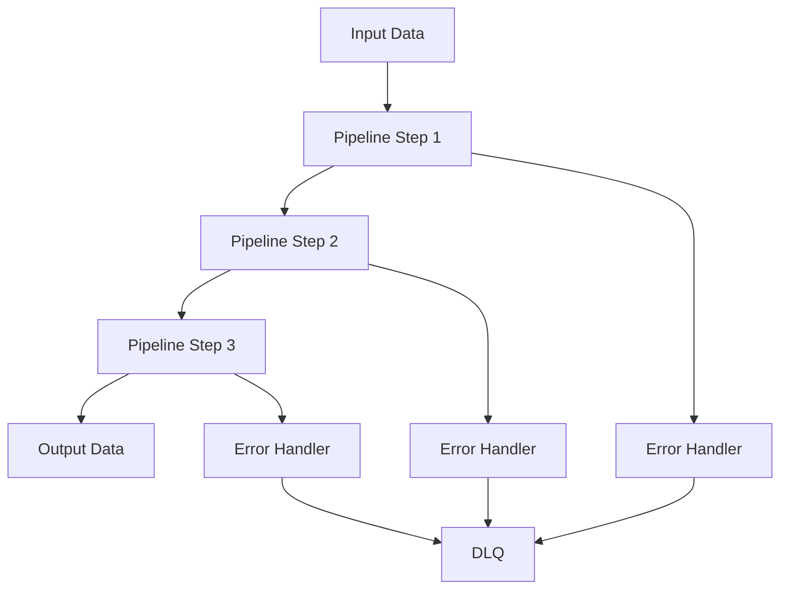
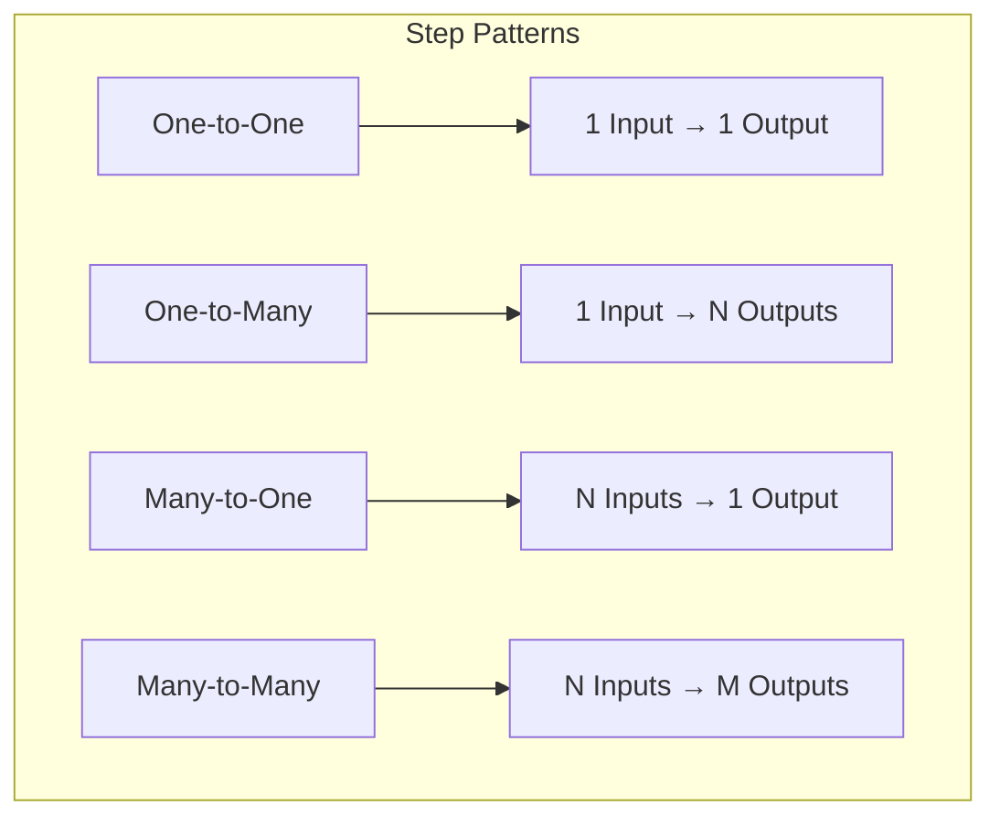
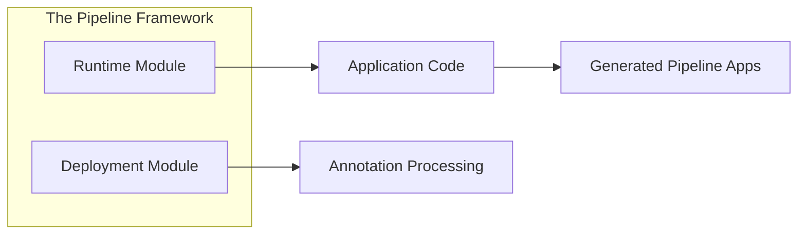
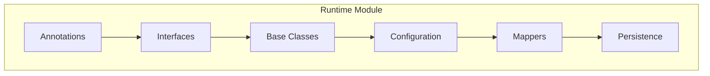
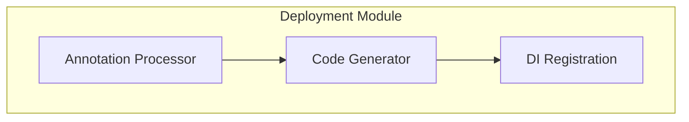
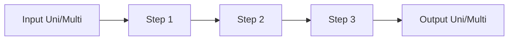
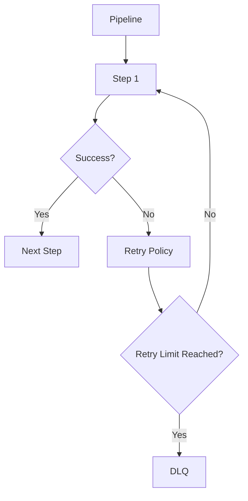

# Architecture

The Pipeline Framework is designed as a modular, extensible system for building reactive pipeline processing applications. Understanding its architecture is key to leveraging its full potential. The framework encourages append-only persistence by default, helping preserve transformations and maintain an audit trail when desired.

## Related Architecture Topics

- [Annotation Processor Architecture](/versions/v26.2/guide/evolve/annotation-processor-architecture): Deep dive into the build-time IR, bindings, and renderers

## Core Concepts

### Pipeline
A pipeline is a sequence of processing steps that transform input data into output data. Each step in the pipeline performs a specific transformation or operation on the data flowing through it. The framework encourages append-only persistence by default; updates are explicit and opt-in.



### Step
A step is a single processing unit within a pipeline. Steps can have different patterns:
- **One-to-One**: Transforms a single input into a single output
- **One-to-Many**: Transforms a single input into multiple outputs
- **Many-to-One**: Aggregates multiple inputs into a single output
- **Many-to-Many**: Transforms multiple inputs into multiple outputs
- **Side Effect**: Performs an operation without changing the data flow



### Mapper
Mappers handle the conversion between different data representations:
- **gRPC objects**: Protocol buffer generated classes
- **Domain objects**: Business logic entities
- **DTO objects**: Data transfer objects

### Adapter
Adapters bridge the gap between the pipeline framework and external systems, handling protocol-specific details like gRPC or REST communication.

## System Architecture

### Runtime and Deployment Modules



### Runtime Module
The runtime module contains the core framework components:

- **Annotations**: `@PipelineStep` for declarative configuration
- **Interfaces**: Step interfaces (`StepOneToOne`, `StepOneToMany`, etc.)
- **Base Classes**: Abstract implementations and utilities
- **Configuration**: `StepConfig`, `PipelineConfig` for runtime behavior
- **Mappers**: `Mapper` interface and implementations
- **Persistence**: `PersistenceManager` for entity persistence



### Deployment Module
The deployment module contains build-time processors:

- **Annotation Processor**: Scans for `@PipelineStep` annotations
- **Code Generation**: Automatically generates gRPC and REST adapters
- **Dependency Injection**: Registers generated beans with the DI container



## Data Flow Patterns

### Reactive Streams
The framework is built on Mutiny reactive streams, supporting both `Uni` (single item) and `Multi` (multiple items) patterns.



### Error Handling
Each step includes built-in error handling with configurable retry policies, circuit breakers, and dead letter queues.



### Concurrency
Steps can be configured to run with different concurrency models, including virtual threads for high-throughput scenarios.

## Module Structure

```text
pipeline-framework/
├── runtime/                 # Core framework components
│   ├── src/main/java/
│   │   └── org/pipelineframework/
│   │       ├── annotation/    # Framework annotations
│   │       ├── cache/          # Cache utilities
│   │       ├── config/         # Configuration classes
│   │       ├── grpc/           # gRPC adapters
│   │       ├── mapper/        # Mapper interfaces
│   │       ├── persistence/   # Persistence utilities
│   │       ├── service/       # Service interfaces
│   │       ├── step/          # Step interfaces and base classes
│   │       └── PipelineExecutionService.java
│   └── pom.xml
├── deployment/              # Build-time processors (used with provided scope)
│   ├── src/main/java/
│   │   └── org/pipelineframework/processor/
│   │       └── PipelineStepProcessor.java
│   └── pom.xml
└── pom.xml
```

Note that the deployment module is typically used with `provided` scope in application POMs since it's only needed at build time for annotation processing.

## Integration Patterns

### gRPC Integration
The framework automatically generates gRPC adapters for pipeline steps, enabling seamless integration with gRPC-based services.

### REST Integration
REST adapters can be generated to expose pipeline steps as HTTP endpoints.

### Database Integration
Persistence is provided via a side-effect plugin and configured as an aspect (typically AFTER_STEP). It observes inputs or outputs and persists them without changing the stream.

## Configuration Model

### Step-Level Configuration
Each step can be independently configured with:

- Retry policies (limit, wait time, backoff)
- Concurrency settings
- Debugging options
- Persistence behavior
- Error recovery strategies

### Pipeline-Level Configuration
Global pipeline settings control:

- Default step configurations
- Environment-specific profiles
- Monitoring and observability
- Resource allocation

## Extension Points

### Custom Steps
Developers can create custom step implementations by extending the provided interfaces.

### Custom Mappers
Mapper interfaces can be implemented to handle specific conversion requirements.

### Custom Adapters
Additional adapters can be created for new protocols or integration patterns.

## Best Practices

### Step Design
- Keep steps focused on a single responsibility
- Design steps to be stateless when possible
- Handle errors gracefully with appropriate recovery mechanisms

### Performance Optimization
- Use virtual threads for I/O-bound operations
- Configure appropriate concurrency levels
- Implement efficient mapper implementations

### Testing
- Test steps in isolation
- Use the framework's testing utilities
- Validate mapper correctness
- Simulate various error conditions
